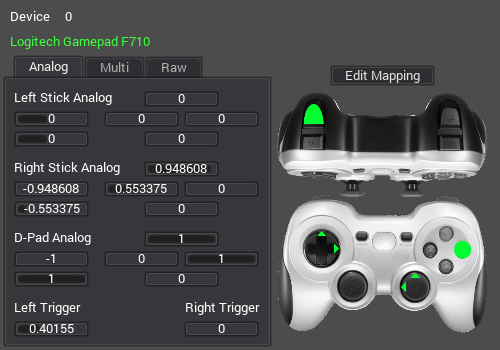
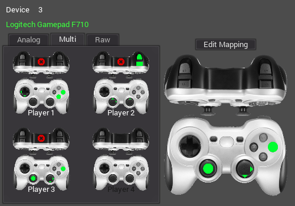
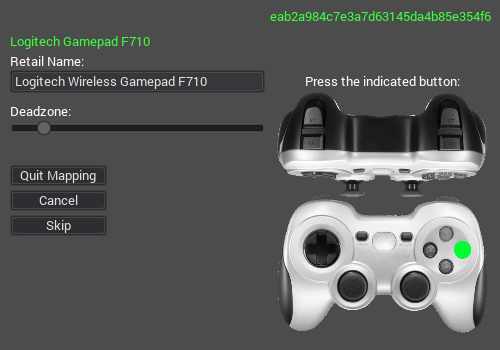
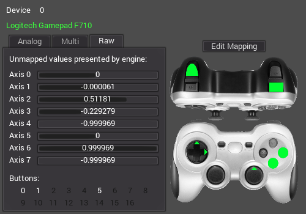

# SUTjoystick & SUTjoystick GUI
---

## Introductions

**SUTjoystick** is a module written in GDScript which you can drop into your project, allowing you to more easily handle joystick input in your games. It does this by seamlessly handling the various layouts of many devices, mapping them to a common, virtual layout. Eliminating device numbers in favor of player numbers, and replacing numbered axes and buttons in favor of human-friendly digital and analog named states provides for consistency and easier joystick support for games made in [Godot Engine](http://www.godotengine.org/). Users of Unity3D may be familiar with InControl, which performs a similar task for that engine, and SDL2-based engines have the capability built in.

**SUTjoystick GUI** is a combination application which utilizes the SUTjoystick module to visually indicate inputs on a virtual gamepad (both raw and massaged data), and serves as an example implementation of most of the features of the module. It also includes the built-in **SUTjoystick Mapper** tool, which is used to create new mapping files for devices not yet supported by our included mappings.

[Click here](https://www.youtube.com/watch?v=ML2hKrhY2ak) for a video walkthrough of the GUI and Mapper tools.



## Basic Module Example Usage

To get started, copy the *[SUTjoystick.gd](https://gitlab.com/shine-upon-thee/joystick/blob/master/SUTjoystick.gd)* module and *js_maps/* directory into your project's directory.

In your Project Settings, go to AutoLoad and add the *SUTjoystick.gd* module. For this example, we'll use the name *SUTjoystick* for the autoload.

While you are in the Project Settings, remove any joystick entries for all active InputMap actions, if you have any. You won't need them, and they could be a source of confusion and inconsistent results if you leave them in place.

Add a member variable at the top of your script, which you will use to reference the module more simply later on.

```python
var JS
```

In your scene's _ready function, assign the variable and optionally set any options or overrides you wish:

```python
func _ready():
    JS = get_node("/root/SUTjoystick")
```

Now, anywhere you wish to check an input, you have two options.

One, you can check the digital state, which is good for buttons and all-or-nothing movement. This should be sufficient for many games. You will get back a 1 (True) or a 0 (False), depending on if a given button or axis is pressed or not. A full list of buttons and axes are detailed later on.

```python
    var move_left = JS.get_digital("leftstick_left")
    var move_right = JS.get_digital("leftstick_right")
    var shoot = JS.get_digital("trig_right")
    var jump = JS.get_digital("action_1")
```

For more finesse in your character controls, you can use analog states for axes, which will return a float value between 0 (off) and 1 (max), or in the case of of composite axes, a value between -1 (min) and 1 (max). A composite axis is essentially a pair of two opposing axes. For example, you can read *leftstick_up* and *leftstick_down* individually, or use their composite *leftstick_ver* for a single range. The choice depends on how you wish to implement the reading in your code. A full list of axes are detailed later on.

Note that each joystick is different, and you might not quite get a full 1.0 at max range, but likely very close. And one more consideration is that every mapping has a deadzone option, below which will always report as 0. You can programmatically override the deadzone if you really wish to (more details later), but it's typically not necessary.

```python
    var movement_left = JS.get_analog("leftstick_left")
    var movement_right = JS.get_analog("leftstick_right")
    var pitch = JS.get_analog("rightstick_ver")
```

In some instances, you may wish for a quick and easy way to fetch the angle of an analog stick, or even the directional pad. SUTjoystick provides the get_angle() function to do just that. It will return the angle in degrees, with 0 pointing straight up. Note that you can only pass the leftstick, rightstick, or dpad values (or any of their aliases). If there is no input on the stick, there is no angle; you will receive a null return.

```python
    var ls_angle = JS.get_angle("leftstick")
    var rs_angle = JS.get_angle("rightstick")
    var dpad_angle = JS.get_angle("dpad")
```

That's pretty much all the basics.

Included in the repository is a patch that would apply the basic use to the official 2D Platformer demo included with Godot Engine. [Click here](https://gitlab.com/shine-upon-thee/joystick/blob/master/2dplatformer.diff) to see it. Alternately, you can [click here](https://www.youtube.com/watch?v=LpO_lczHCUY) to watch the full procedure in video tutorial format.

## Digital States Listing

| Name             | Description |
| ---------------- | ----------- |
| leftstick_up     | Left analog stick pushed up |
| leftstick_down   | Left analog stick pushed down |
| leftstick_left   | Left analog stick pushed left |
| leftstick_right  | Left analog stick pushed right |
| rightstick_up    | Right analog stick pushed up |
| rightstick_down  | Right analog stick pushed down |
| rightstick_left  | Right analog stick pushed left |
| rightstick_right | Right analog stick pushed right |
| dpad_up          | Up on directional pad |
| dpad_down        | Down on directional pad |
| dpad_left        | Left on directional pad |
| dpad_right       | Right on directional pad |
| trig_left        | Left trigger pulled |
| trig_right       | Right trigger pulled |
| bump_left        | Left bumper pushed |
| bump_right       | Right bumper pushed |
| click_left       | Left analog stick pushed in |
| click_right      | Right analog stick pushed in |
| action_1         | Face button in 6 o'clock position pushed (typically A) |
| action_2         | Face button in 3 o'clock position pushed (typically B) |
| action_3         | Face button in 9 o'clock position pushed (typically X) |
| action_4         | Face button in 12 o'clock position pushed (typically Y) |
| back             | Back button pressed |
| start            | Start button pressed |
| home             | Home button pressed |

## Analog States Listing

| Name             | Description |
| ---------------- | ----------- |
| leftstick_up     | Left analog stick pushed up |
| leftstick_down   | Left analog stick pushed down |
| leftstick_left   | Left analog stick pushed left |
| leftstick_right  | Left analog stick pushed right |
| rightstick_up    | Right analog stick pushed up |
| rightstick_down  | Right analog stick pushed down |
| rightstick_left  | Right analog stick pushed left |
| rightstick_right | Right analog stick pushed right |
| dpad_up          | Up on directional pad |
| dpad_down        | Down on directional pad |
| dpad_left        | Left on directional pad |
| dpad_right       | Right on directional pad |
| trig_left        | Left trigger pulled |
| trig_right       | Right trigger pulled |
| leftstick_hor    | Composite axis: leftstick_right - leftstick_left |
| leftstick_ver    | Composite axis: leftstick_down - leftstick_up |
| rightstick_hor   | Composite axis: rightstick_right - rightstick_left |
| rightstick_ver   | Composite axis: rightstick_down - rightstick_up |
| dpad_hor         | Composite axis: dpad_right - dpad_left |
| dpad_ver         | Composite axis: dpad_down - dpad_up |

## Action Aliases ##

The actions have aliases so you can choose whatever is most comfortable for you. An asterisk in the below chart means wildcard. For instance, looking at the chart, leftstick_ver could also be written as ls_vertical.

| Action | Aliases |
| ------ | ------- |
| rightstick_\* | rstick_\*, right_\*, rs_\* |
| leftstick_\*  | lstick_\*, left_\*, ls_\* |
| dpad_\*       | d-pad_\*, d_pad_\*, direction_\*, directionpad_\* |
| trig_\*       | trigger_\* |
| bump_\*       | bumper_\*, shoulder_\* |
| \*_ver        | \*_vert, \*_vertical |
| \*_hor        | \*_horiz, \*_horizontal |
| action_1     | action_a, action_south, action_s, action_down, action_green, action_cross |
| action_2     | action_b, action_east, action_e, action_right, action_red, action_circle |
| action_3     | action_x, action_west, action_w, action_left, action_blue, action_square |
| action_4     | action_y, action_north, action_n, action_up, action_yellow, action_triangle |
| home         | guide, playstation, ps |
| start        | system, run |
| back         | select, option |

## Multiple Controllers

SUTjoystick handles joysticks, their mappings, and input states for up to four players at a time. After your project launches, the first device to receive input will be assigned to the first player slot (1), the second will be assigned to player two (2), and so on. If four devices are assigned and a button event is received from a fifth, it will simply be ignored. This can be easily expanded, but unless a need is expressed, it will remain limited to four slots.



By default, the get_analog and get_digital functions will return the state of any player. If you wish to check input for a specific player, pass 1 as a second parameter to the function for player one, 2 for the second player, and so on. Here is an example of checking the status of all four players' Start buttons:

```python
    var player1_start = JS.get_digital("start", 1)
    var player2_start = JS.get_digital("start", 2)
    var player3_start = JS.get_digital("start", 3)
    var player4_start = JS.get_digital("start", 4)
```

## Active Device Feature

If you don't care which controller is used for a particular action, say for a single-player game or for pausing the game or such, just omit the player number from the state retrieval functions:

```python
    var any_player_start = JS.get_digital("start") # JS.get_digital("start", 0) also works
```

## Managing Devices

SUTjoystick does a lot for you automatically; however, you may wish to access the controller name in use by a player, or the raw device number assigned to a player, or maybe you wish to provide a way to deregister devices. Here are the functions and example context to do just that:

```python
    var player2_device_num = JS.get_device_number(2) # returns the device number assigned to player 2
    var player3_controller = JS.get_device_name(3) # returns the common name of the device assigned to player 3
    var device0_player = JS.get_device_player(0) # returns the player slot number which device 0 is assigned to (or 0 if it is not assigned)
    JS.deregister_player(1) # clears the assigned device from player 1's slot
    JS.deregister_player() # clears all device assignments
```

## Device Assignment Behavior

Devices are automatically assigned to open player slots when connected to the system, or upon input if already connected.

By default, active devices will be reassigned dynamically when a player slot opens up. For example, if you have three devices assigned to players 1 through 3, and player 1's device is disconnected or deregisters, the first device to be connected or send input will be assigned to the 1st player slot, even if already assigned. If player 3 pushes a button first, player slot 3 will open up and this device now becomes player 1.

To disable this behavior, simply set the **reassign_active_devices** option to false in your script. Now, if you have the same example scenario with three devices assigned to players 1 through 3, and player 1's device is disconnected or deregisters, the other players' devices will stay in the 2nd and 3rd slots, and there will be no player 1 device until a new, unassigned device is connected or sends input.

Choose whichever mode suits your needs best.

## Basic Mouse Emulation

Programming gamepad support for menus can be difficult, so SUTjoystick has the ability to control a virtual mouse pointer, and submit mouse clicks and scroll wheel events. The controls are set to move the mouse pointer with the left stick, scroll wheel with up/down on the right stick and direction pad, while the left, right, and middle mouse button clicks are mapped to action_1, action_2, and action_4, respectively.

To enable mouse emulation, simply call:

```python
    JS.emulate_mouse(true)
```

Note that the virtual cursor will jump to the middle of the game window by default.

At any point you can then disable mouse emulation. By default, the cursor will jump to the bottom-right corner of the game window, in order to get it out of the way.

```python
    JS.emulate_mouse(false)
```

You can disable the cursor warping behavior if you wish. You can also control the maximum cursor movement speed, or manually set the virtual mouse cursor's position at any time:

```python
    JS.disable_mouse_warp = true
    JS.virtual_mouse_speed = 1000 # default is 500
    JS.virtual_mouse_pos = Vector2(200,100)
```

Note that the basic mouse emulation is only intended as a stop-gap measure; it is not going to replace a well-designed navigable menu or character controller made specifically for gamepads. That being said, as a massive gamepad fan myself, I would appreciate navigable menus in this manner far more than being required to pick up a keyboard or mouse.

## Suppressing Output Messages

If you don't want to see the terminal output from the SUTjoystick module, simply set the **verbose** option to false. You can toggle this boolean at any point in your script, if you wish to debug only at certain parts of your script.

## Mappings

SUTjoystick will search for a mapping layout for a device when the first button is pressed on it.

It will search first in your project's user:// directory. If no mapping is found, it will then search in your project's res://js_maps/ directory. If no mapping is found, it will check the mappings built-in to the module itself.

Mapping files are stored as plain-text JSON, so one could manually make a mapping with nothing other than a text editor. However, we've included the SUTjoystick Mapper tool, which can be used to generate a mapping file easily. Resulting mappings will be stored in the Godot configuration directory, under */app_userdata/SUTjoystick/* and can be copied into other projects which use SUTjoystick. The mapping tool is not completely perfect, but it should work in the majority of cases.



## Submitting New Mappings

We appreciate all contributions of joystick mappings. If you have a joystick that we have not already got support for, please map it with SUTjoystick GUI, and when complete, click the Upload button. This will let you submit the mapping to our website in your web browser, and we will then add it to this project. Alternately, feel free to send a pull request or send the mapping file(s) to us directly via email to [joystick@shineuponthee.com](mailto:joystick@shineuponthee.com).

If you submit a mapping, do not delete or otherwise alter portions of the mapping without reason. Any incomplete mappings will be rejected. We are not collecting your operating system to spy on you; it is required for the mapping to function correctly, because each controller produces a potentially different button and axis layout, and a different controller name, depending on which OS and driver is being used.

Here is a [slightly-outdated] video tutorial for making a new mapping, as well as submitting via the Upload button: http://youtu.be/y4kOBquXWEQ

## Fallback Mapping

If no mapping is found, a default Xinput mapping is hard-coded, and the module will fallback to this.

If you would rather disable this behavior, you can set the module's **disable_fallback_map** option to false.

## Built-In Mapping Listing

| Device Name        | LIN | WIN | OSX |
| ------------------ | --- | --- | --- |
| Apollo GP-3020 PC Joy Pad                       | X | X |  |
| ASUS XitePad                                    | X | X |  |
| Hori Gem Pad 3                                  | X |  |  |
| InterAct Hammerhead FX Gamepad                  | X |  |  |
| Logitech Cordless RumblePad 2                   | X |  |  |
| Logitech Dual Action Gamepad                    | X | X |  |
| Logitech F310 Gamepad                           | X | X |  |
| Logitech F510 Gamepad                           | X | X |  |
| Logitech F710 Wireless Gamepad                  | X | X |  |
| Microsoft Xbox 360 Controller (xboxdrv)         | X |  |  |
| Microsoft Xbox 360 Wired Controller for Windows | X |  |  |
| Nintendo Wii Classic Controller                 | X |  |  |
| Ouya Wireless Controller                        | X | X |  |
| PDP Rock Candy Wireless Controller (PS3)        | X |  |  |
| SLS Sega Saturn USB Control Pad (Cypress)       | X |  |  |
| SPEEDLINK Strike Gamepad                        | X |  |  |
| SPEEDLINK XEOX Pro Analog Gamepad               | X | X |  |
| Sony DualShock 3 Controller                     | X |  |  |
| Sony DualShock 4 Controller                     | X |  |  |
| Sony Navigation Controller                      | X |  |  |
| Sony SIXAXIS Controller                         | X |  |  |
| Thrustmaster T-Flight Hotas X Flight Stick      | X |  |  |

## Important Notes & Caveats

The master branch of this module aims to stay compatible with and adapt to changes in the Godot Engine master branch. If you are using an older release of the engine, you should use the matching branch of this project.

If you are using Godot 1.0, you can use the [1.0 branch of SUTjoystick](https://gitlab.com/shine-upon-thee/joystick/tree/1.0).

Older branches may not be maintained, and may be missing features from newer versions of the module. Read the Important Notes & Caveats section to be sure you are aware of the limitations of older branches.

The author of this module doesn't have access to any non-Linux computers, so we rely on SUTjoystick users to submit mappings for other operating systems.

SUTjoystick currently supports Linux and Windows.

Godot for Windows currently supports only one gamepad at a time.

Godot for OSX currently has no gamepad support whatsoever.

Other platforms are not yet supported in the master branch of SUTjoystick.



## Known Projects Using SUTjoystick

This section of the page is dedicated to listing games that utilize this module. If you use the module and would like to be listed here, send an email to [joystick@shineuponthee.com](mailto:joystick@shineuponthee.com).

* **Battle Tic Tac Toe** (unreleased) by Shine Upon Thee
* **[Minilens](https://github.com/alketii/minilens)**
* **Project Scapegoat** (unreleased) by Shine Upon Thee
